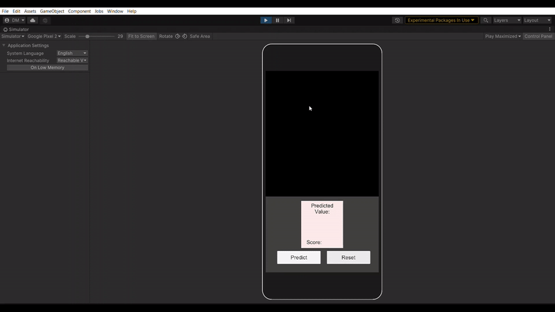

# Unity-MNIST-Barracuda
 Deploying a MNIST model for android mobile devices using the Barracuda package in Unity3D.
 
 A simple App that determines/predicts the number drawn by the user on texture with the help of MNIST model.
 
 ### Demo:
 

 ### Testing:
 1. Clone the repository using the following command in Git:
   ```
   git clone https://github.com/NotFarFromBlonded/Unity-MNIST-Barracuda.git
   ```
 2. Navigate inside the cloned project using
   ```
   cd Unity-MNIST-Barracuda
   ```
 3. Install Unity Release 2021.2.7f1 from the link [here](https://unity3d.com/get-unity/download/archive).
 4. Open the project folder in the Unity Editor.
 5. Navigate to `Scenes` folder and open `SampleScene`. Set the dimensions of game view window to __1920x1080 potrait__ (For best results download Device-Simulator for unity using package manager).
 6. Press play.
  
 ### Installation:
 Download the apk file from apk->MNISTBarracudaUNITY.apk and install it in your android device
 
 ### Packages used:
 - Barracuda
 - Device-simulator
